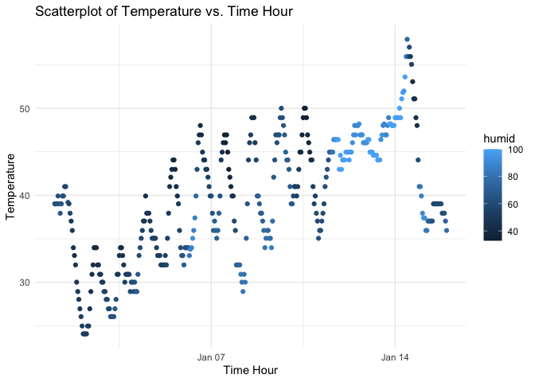

HW 1 Data Science
================
Victoria Mello vsm2118
September 19, 2023

# Promblem 1

``` r
# Load the moderndive package
library(moderndive)

# Load the early_january_weather dataset
data("early_january_weather")
```

The `early_january_weather` dataset contains information about…

``` r
# Access dataset help file
?early_january_weather
```

``` r
# Variables in the dataset
names(early_january_weather)
```

    ##  [1] "origin"     "year"       "month"      "day"        "hour"      
    ##  [6] "temp"       "dewp"       "humid"      "wind_dir"   "wind_speed"
    ## [11] "wind_gust"  "precip"     "pressure"   "visib"      "time_hour"

``` r
# Size of the dataset (number of rows and columns)
nrow(early_january_weather)  # Number of rows
```

    ## [1] 358

``` r
ncol(early_january_weather)  # Number of columns
```

    ## [1] 15

``` r
# Mean temperature
mean_temp <- mean(early_january_weather$temp)
mean_temp
```

    ## [1] 39.58212

``` r
library(ggplot2)

# Create the scatterplot
scatter_plot <- ggplot(early_january_weather, aes(x = time_hour, y = temp, color = humid)) +
  geom_point() +
  labs(x = "Time Hour", y = "Temperature", title = "Scatterplot of Temperature vs. Time Hour") +
  theme_minimal()

# Display the scatterplot
print(scatter_plot)
```

<!-- -->

In the scatterplot we observe that during the month of January the
temperature at the beginning of the month was around 40 degrees
fahrenheit and sharply decreased to below 25 degrees. While there are
fluctuations, the temperature appears to follow a generally increasing
trend throughout the month until January 15th where there is a peak
temperature of around 60 degrees, followed by a sharp decline down to
about 35 degrees where the temperature remained for the rest of the
month. There was a notable period of high humidity, as shown by the
lighter blue data points on the scatterplot, which started around
January 10 and ended around the 15th.

``` r
# Export the scatterplot as an image file (e.g., PNG) to your project directory
ggsave("scatterplot.png", plot = scatter_plot, width = 6, height = 4)
```
